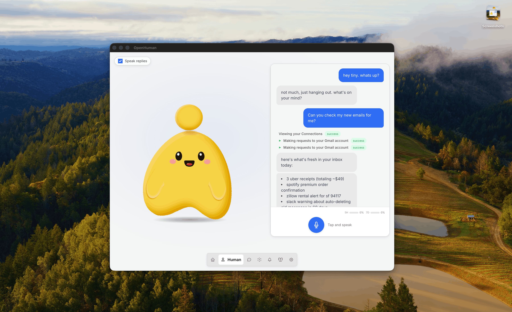

# 欢迎使用 OpenHuman

<figure><figcaption></figcaption></figure>

OpenHuman 是一款开源 AI 助手，旨在成为你跨工具协作时的**记忆**与**执行者**。基于 Rust + Tauri 构建，采用 GNU GPL3 许可证，它弥合了 AI 模型能做什么与它们实际上了解**你**多少之间的差距。

世界上所有的模型，200 多个，都面临同一个根本性限制：它们是无状态的。你输入一段提示，得到回复，然后上下文就消失了。即便那些自称有"记忆"的模型，也只存储了几条要点。几条要点是便利贴，不是智能。

OpenHuman 通过一套冷静、刻意不同的技术栈解决了这个问题：

* **本地优先的** [**记忆树**](features/obsidian-wiki/memory-tree.zh-CN.md)**。** 你连接的每一个来源——Gmail、Slack、GitHub、Notion、你自己的笔记——都会流经一个确定性流水线：规范 Markdown、≤3k token 的块、评分、折叠成按来源 / 按主题 / 按日期的摘要树。存储在你机器上的 SQLite 中。没有向量黑盒。
* **其上的** [**Obsidian 风格 Wiki**](features/obsidian-wiki/)**。智能体用于推理的同样的块，会作为 `.md` 文件落在一个你可以用 [Obsidian](https://obsidian.md) 打开的仓库中，手动浏览、编辑和链接。灵感来自 [Karpathy 的 obsidian-wiki 工作流](https://x.com/karpathy/status/2039805659525644595)。你无法信任一个你无法阅读的记忆。
* [**118+ 第三方集成**](features/integrations/README.zh-CN.md)**。** 一键 OAuth 接入 Gmail、GitHub、Slack、Notion、Stripe、Calendar、Drive、Linear、Jira 等——无需手动配置 API key，无需在插件市场中翻找。
* [**自动拉取**](features/obsidian-wiki/auto-fetch.zh-CN.md)**。** 每二十分钟，OpenHuman 会从每一个活跃连接中拉取最新数据，并在你无需开口的情况下将其折叠进记忆树，这样智能体在早上就已经拥有了明天的上下文。
* **为大数据而生的智能体。** [智能 Token 压缩（TokenJuice）](features/token-compression.zh-CN.md) 在冗长的工具输出进入模型上下文之前对其进行压缩，因此横扫过去六个月邮件的成本仅为个位数美元。[自动模型路由](features/model-routing/) 将每个任务发送给合适的模型——`hint:reasoning` 交给前沿模型，`hint:fast` 交给廉价模型，视觉任务交给视觉模型——全部在一个订阅下完成。可选的 [本地 AI（通过 Ollama 或 LM Studio）](features/model-routing/local-ai.zh-CN.md) 让支持的负载保留在设备上。
* [**开箱即用**](features/native-tools/)**。一套完整的智能体工具链默认已接入：[网页搜索](features/native-tools/web-search.zh-CN.md)、[网页抓取](features/native-tools/web-scraper.zh-CN.md)、全套[编程工具集](features/native-tools/coder.zh-CN.md)（文件系统、git、lint、test、grep）、[浏览器与电脑控制](features/native-tools/browser-and-computer.zh-CN.md)、[定时任务与调度](features/native-tools/cron.zh-CN.md)、[记忆工具](features/native-tools/memory-tools.zh-CN.md)、用于生成子智能体的[智能体协调](features/native-tools/agent-coordination.zh-CN.md)，以及[原生语音](features/native-tools/voice.zh-CN.md)——STT 输入、TTS 输出、吉祥物口型同步，还有一个实时 Google Meet 智能体，它可以加入会议、将会议转录进你的记忆树，并在通话中回话。没有"装个插件才能读文件"的摩擦。
* **简洁，UI 优先。** 干净的桌面体验和简短的引导路径，让你在几次点击内从安装到拥有一个可用的智能体——无需先配 config，无需终端。智能体[有一张脸](features/mascot/README.zh-CN.md)：一个桌面吉祥物，会说话、对周围环境作出反应、作为真实参与者加入你的 Google Meet、在数周内记住你，甚至在你停止打字后仍在后台思考。

这些特性合在一起，让 OpenHuman 从根本上不同于聊天机器人。它是一个能够低成本消费大量个人数据、对你的世界保持持久且不断演进的理解、并代表你采取主动行动的 AI 智能体。


OpenHuman 不是 AGI。但它在更好的记忆、更好的编排和更好的工具链方面，是一个有意义的架构进步。

